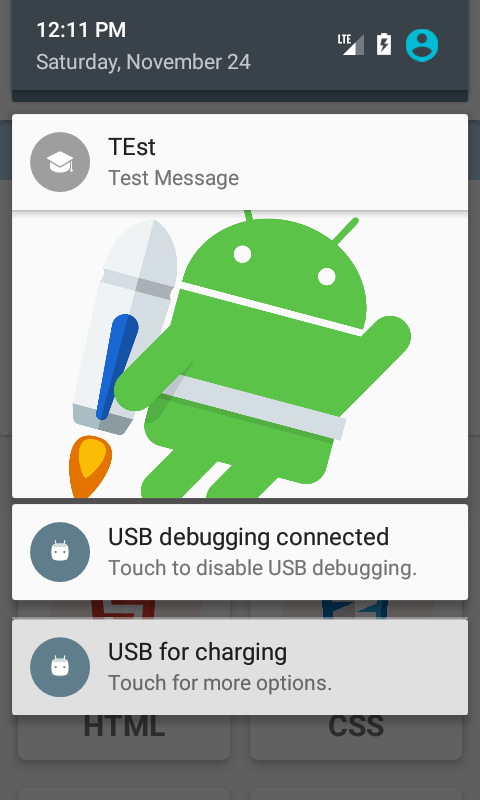
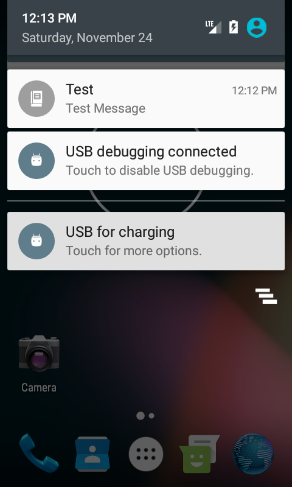

# NotificationHelper
This is android Library to help show Notification in any device
To get a Git project into your build:

Step 1. Add the JitPack repository to your build file

  - Gradle
  ```sh
allprojects {
		repositories {
			...
			maven { url 'https://jitpack.io' }
		}
	}
```
Step 2. Add the dependency
  ```sh
dependencies {
	        implementation 'com.github.quintuslabs:NotificationHelper:2.1'
	}
```
Step 3. Show Notification:

Small Notification
----

  ```sh
         Intent intent = new Intent(YourActivity.this,TargetActivity.class);

        NotificationHelper notificationHelper = new NotificationHelper(getApplicationContext());
        notificationHelper.createNotification("Test","Test Message",R.drawable.ic_luncher,intent);
	

```
Big Notification
----

  ```sh
         Intent intent = new Intent(YourActivity.this,TargetActivity.class);

        NotificationHelper notificationHelper = new NotificationHelper(getApplicationContext());
        notificationHelper.createNotification("Test","Test Message",R.drawable.ic_luncher,"imageUrl",intent);
	

```

ScreenShot
----



License
----

MIT


**Free Software**


